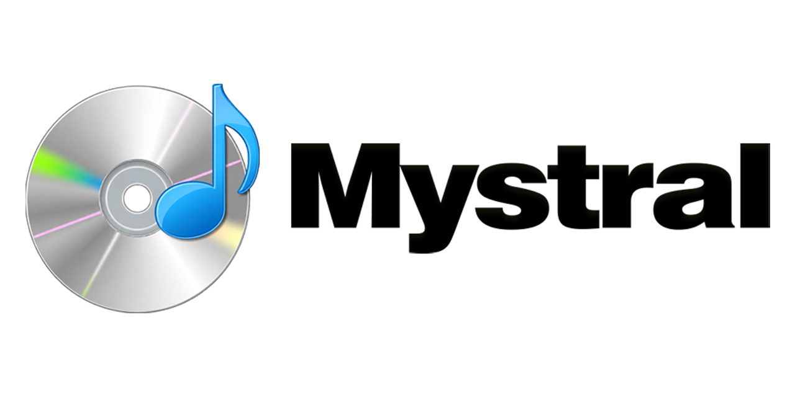

# Mystral


Mystral is a Windows desktop music companion built with WPF. It reads the active
Windows media session and gives you playback controls, lyrics, Last.fm links and
optional scrobbling, and a tray-based workflow for "burning" audio files
(re-tagging them with cover/jewel-case artwork) and optionally sharing them.

## Screenshots

<!--
  To add a screenshot: save the image to assets/screenshots/<name>.png and
  uncomment the matching line below. Keep captions short. GitHub renders these
  relative paths automatically.
-->

## Features

- Reflects the active Windows media session: title, artist, artwork, progress,
  duration, and play state.
- Playback controls: play/pause, next, previous, and seek.
- System output volume control with mute.
- Synced or plain lyrics with a scrolling and fullscreen lyrics view.
- Last.fm track links and optional scrobbling.
- "Burn" a track: write metadata plus composited CD and jewel-case artwork to a
  copy of the audio file, with optional sharing.
- Track-change and burn notifications.
- Tray icon with close-to-tray, always-on-top, and start-with-Windows options.
- Single-instance activation through a custom URL protocol.

## Requirements

- Windows 10 1809 (build 17763) or newer.
- .NET SDK 8.0 or newer for development.
- Inno Setup 6 to build the Windows installer.
- A Last.fm API account for Last.fm links and scrobbling (optional).

## Getting Started

Restore, build, and run from the repository root:

```powershell
dotnet restore .\Mystral.csproj
dotnet build .\Mystral.csproj
dotnet run --project .\Mystral.csproj
```

You can also run the project from Visual Studio or Rider.

## Configuration

Open **Settings** from the app window or the tray menu.

### Last.fm (optional)

Under the **Last.fm** category, enable Last.fm and provide:

- API key
- API secret
- Username
- Password
- `Scrobble playback to Last.fm`, if wanted

Credentials are validated when settings are saved. Scrobbling uses the Last.fm
`auth.getMobileSession`, `track.updateNowPlaying`, and `track.scrobble` methods.

### Social sharing (optional)

Mystral can share a "burned" CD to a social profile. The default backend
(`chat.ponkis.xyz`) is proprietary, so out-of-the-box linking only works against
that service. The sharing layer is isolated in `Services/GlobeConnectionService.cs`
and `Services/GlobeApiClient.cs`, so you can adapt it to your own endpoint if you
want to self-host sharing. Configure it under **Settings → Social**:

- A configurable ad field.
- An auto-share toggle.
- A profile area showing avatar, name, username, and "burn" count.

## Settings Storage

Settings are stored per build environment:

```text
# Debug builds
%LOCALAPPDATA%\Mystral Development\settings.json

# Release builds
%LOCALAPPDATA%\Mystral\settings.json
```

Sensitive values (Last.fm credentials and the sharing token) live in a separate, per-user encrypted credential store next to the settings file.

## Testing

The automated tests live in `tests\Mystral.Tests`. Run the core suite:

```powershell
dotnet restore .\tests\Mystral.Tests\Mystral.Tests.csproj
dotnet run --project .\tests\Mystral.Tests\Mystral.Tests.csproj --no-restore
```

If NuGet is unavailable but the SDK packs are cached locally, restore from the
local package cache:

```powershell
dotnet restore .\tests\Mystral.Tests\Mystral.Tests.csproj --source "$env:USERPROFILE\.nuget\packages"
```

The suite covers the headless application logic: LRC parsing, Last.fm metadata
cleanup and API paths, LRCLIB search and caching, settings persistence and
corrupt-file fallback, local scrobble history, artwork composition and tinting,
MusicBrainz mapping and retries, and audio-tag burning.

GitHub Actions runs the same build-and-test checks on every push and pull request
(`.github\workflows\ci.yml`).

Before a release, also run the Windows-only checklist in
[`SMOKE_TEST.md`](SMOKE_TEST.md): window and tray states, media-session controls,
system volume, notifications, and installer output.

## Building & Releasing

### Build environments

The build environment is selected through MSBuild and kept isolated on disk so a
Development build can never be silently replaced by a Production one:

- Debug defaults to `AppEnvironment=Development`.
- Release defaults to `AppEnvironment=Production`.
- Output goes to `bin\<Configuration>\<AppEnvironment>`.

```powershell
dotnet build .\Mystral.csproj -c Debug   /p:AppEnvironment=Development
dotnet build .\Mystral.csproj -c Release /p:AppEnvironment=Production
```

Development builds target a local backend (`http://localhost:3000/`) and register
the `mystral-dev://` URL protocol. Production builds target `https://chat.ponkis.xyz/`
and register `mystral://`.

Register the development URL protocol from a normal (non-elevated) Windows shell,
because the handler is stored in the current user's `HKCU` registry hive:

```powershell
.\scripts\Register-DevProtocol.cmd
```

### Development builds

Packaged development builds use Release optimizations with
`AppEnvironment=Development`, so you can test a packaged build without touching
production settings:

```powershell
.\scripts\Build-Dev.ps1 -Clean -Run
```

The output is written to:

```text
artifacts\dev\Mystral-<version>-dev-win-x64-folder\Mystral.exe
```

### Production releases

Production releases are built by GitHub Actions from `v*.*.*` tags on `main`. The
workflow validates that the tag matches the MSBuild Release version, publishes
self-contained `win-x64` builds, creates the Inno Setup installer, generates
SHA-256 checksums, and attaches everything to a GitHub Release. It can also be
started manually from the Actions tab.

Recommended branch flow:

```text
work on dev -> build locally -> commit and push dev -> merge dev into main -> vX.Y.Z tag -> GitHub Release
```

Helper scripts:

```powershell
# Merge dev into main and push
.\scripts\Promote-DevToMain.ps1

# Merge, push main, and create the release tag in one step
.\scripts\Promote-DevToMain.ps1 -Release
```

To produce release binaries locally, resolve the version and publish:

```powershell
$version = dotnet msbuild .\Mystral.csproj -nologo -getProperty:Version -p:Configuration=Release

# Self-contained single file
dotnet publish .\Mystral.csproj -c Release -r win-x64 --self-contained true `
  -o ".\artifacts\publish\Mystral-$version-win-x64-single" `
  /p:AppEnvironment=Production /p:PublishSingleFile=true `
  /p:IncludeAllContentForSelfExtract=true /p:EnableCompressionInSingleFile=true `
  /p:UseAppHost=true /p:DebugType=None /p:DebugSymbols=false

# Self-contained folder (packaged by the installer)
dotnet publish .\Mystral.csproj -c Release -r win-x64 --self-contained true `
  -o ".\artifacts\publish\Mystral-$version-win-x64-folder" `
  /p:AppEnvironment=Production /p:PublishSingleFile=false `
  /p:UseAppHost=true /p:DebugType=None /p:DebugSymbols=false
```

### Installer

Install Inno Setup, build the folder publish, then build the installer:

```powershell
winget install JRSoftware.InnoSetup
powershell -NoProfile -ExecutionPolicy Bypass -File .\installer\Build-Installer.ps1
```

The installer is written to:

```text
artifacts\installer\Mystral-<version>-win-x64-setup.exe
```

## Versioning

The project version is centralized in `Directory.Build.props`:

```xml
<VersionPrefix>2.0.1</VersionPrefix>
```

To bump the app version, edit `VersionPrefix`. Debug builds automatically append a
`-dev` suffix; Release builds use the plain version.

## Project Layout

```text
Configuration/   App metadata, environment resolution, trusted-host checks
Controls/        Reusable WPF controls (CD art, jewel case, social profile)
Infrastructure/  Low-level interop (audio endpoint)
Models/          Records and DTOs (settings, media, lyrics, Last.fm, sharing)
Parsing/         LRC lyric parsing
Services/        Media session, lyrics, Last.fm, volume, artwork, sharing, storage
Views/           WPF windows (main, settings, burn, notifications, dialogs)
Resources/       Icons, images, and audio bundled into the app
scripts/         Dev build, release promotion, and protocol registration scripts
installer/       Inno Setup script and installer build script
tests/           Headless test runner (Mystral.Tests)
```
## Trailer


## Contributing & Community

- Report bugs and request features through the
  [issue templates](.github/ISSUE_TEMPLATE).
- Report security vulnerabilities privately — see [`SECURITY.md`](SECURITY.md).
- Participation is governed by our [Code of Conduct](CODE_OF_CONDUCT.md).

## License

Mystral's source code is licensed under the **Mozilla Public License 2.0** — see
[`LICENSE`](LICENSE).

> **Note:** some bundled assets (for example the Windows 7-style busy animation)
> are Microsoft-owned and are **not** covered by the MPL-2.0 grant. If you
> redistribute Mystral, read [`NOTICE.md`](NOTICE.md) first.
