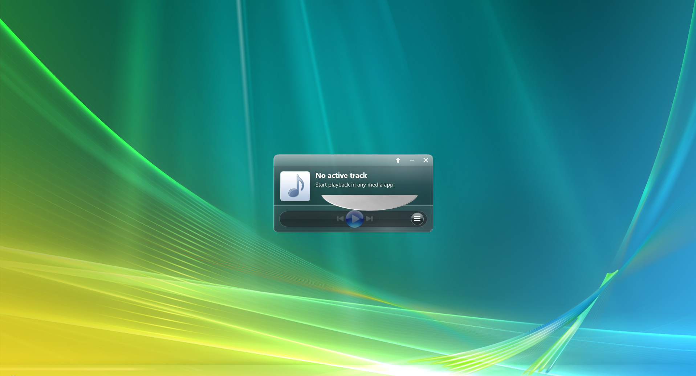
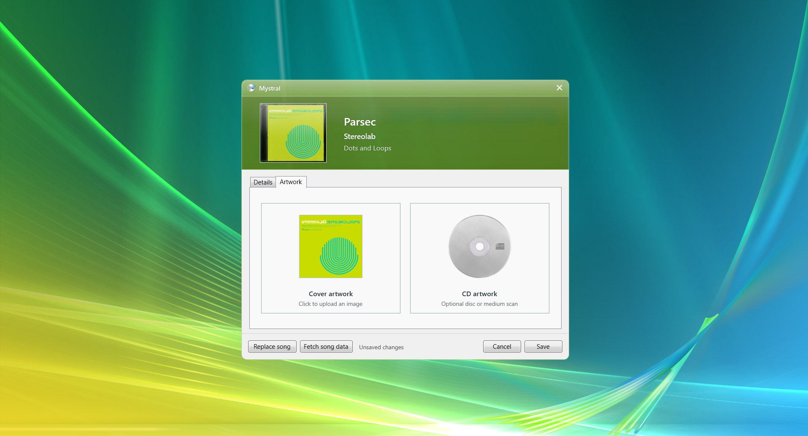
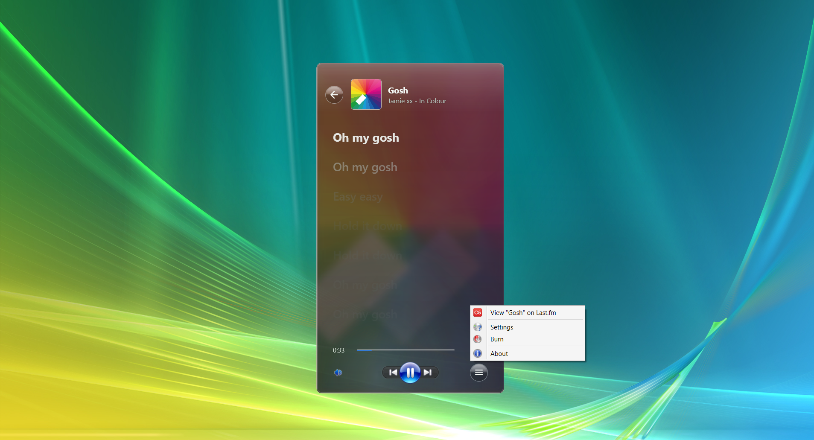
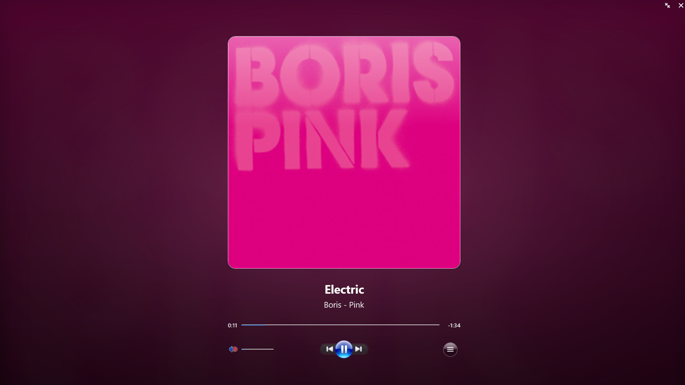
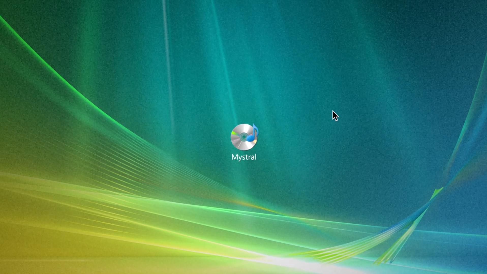

# Mystral

Mystral is a Windows desktop music companion. It follows the active Windows
media session and provides playback controls, lyrics, MusicBrainz information,
Last.fm integration, themed artwork, and tools for creating a retagged copy of
an audio file with CD and jewel-case artwork.

## Features

- Mirrors the active Windows media session: title, artist, artwork, progress,
  duration, playback state, and supported transport controls.
- Controls play/pause, next, previous, seeking, system output volume, and mute.
- Displays synchronized or plain lyrics in regular, attached information, and
  fullscreen views. Seekable synchronized lines can be clicked to jump.
- Shows attached Track, Artist, and Album information from MusicBrainz without
  opening another window.
- Supports Last.fm track links and optional scrobbling.
- Follows album artwork colors automatically or uses a custom player theme.
- Supports animated Apple Music artwork when it is available.
- Creates a separate retagged audio copy with editable metadata, lyrics, cover
  art, disc art, and composited jewel-case artwork.
- Provides track-change notifications, update checks, playback history, and a
  tray menu with close-to-tray, always-on-top, and start-with-Windows options.
- Can optionally link to the hosted Mystral social-sharing service.

## Requirements

For released builds:

- Windows 10 version 1809 (build 17763) or newer.
- No separate .NET runtime installation is required by the self-contained
  release packages.

For contributors:

- .NET SDK 8.0 or newer.
- Inno Setup 6 only when building the Windows installer.
- A Last.fm API account only when testing Last.fm integration.

## Install

Download the installer or portable archive from the project’s
[GitHub Releases](https://github.com/ponkis/mystral/releases) page. Release builds use production settings
and keep their data separate from local development builds.

## Build from source

From the repository root:

~~~powershell
dotnet restore .\Mystral.csproj
dotnet build .\Mystral.csproj
dotnet run --project .\Mystral.csproj
~~~

Visual Studio and Rider can also open Mystral.csproj directly.

## Configuration

Open **Settings** from the player or tray menu.

### Last.fm

Last.fm is optional. An API key and username enable track links and the profile
shortcut. Scrobbling additionally requires the API secret and account password.
Credentials are validated before scrobbling is enabled.

### Appearance

The player can derive its tint from the active artwork or use a custom color.
Automatic mode restores cover-derived backgrounds; a fixed color hides those
backgrounds while keeping foreground artwork visible.

### Lyrics

Mystral supports synchronized and plain lyrics. During automatic following,
completed synchronized lines leave the regular lyrics viewport; scrolling
restores them for browsing. Active synchronized lines use the same disc-style
highlight in regular, attached information, and fullscreen lyrics.

For Apple Music on Windows, Mystral accounts for media sessions that combine the
artist and album fields or omit the primary artist value.

### Music information

Open **More** while a track is playing and choose **Track information**,
**Artist information**, or **Album information**. The player unfolds into an
attached information surface while playback controls remain available.

The views contain matched recording, artist, release, and track-list details
from MusicBrainz. Artist photographs are shown only when MusicBrainz links to a
supported Wikimedia Commons image. If lyrics are opened from this surface, they
slide out in an attached drawer without replacing the selected information tab.

MusicBrainz lookups do not require an account or API key.

### Animated artwork

When supported Apple Music artwork is available, Mystral caches and loops it in
the player’s artwork views. Albums without an animation continue using their
regular cover. Animated artwork is resolved through artwork.m8tec.top.

## Burn editor

The burn editor always writes a separate same-format copy; it never modifies the
selected source file. It can edit:

- title, artist, album, date, track, genre, and related metadata;
- cover and disc artwork;
- plain lyrics;
- synchronized LRC lyrics.

**Fetch song data** uses MusicBrainz and the Cover Art Archive for metadata and
artwork, and LRCLIB for lyric text. Results remain editable before saving.

## Settings and credentials

Settings are stored per environment:

~~~text
Development: %LOCALAPPDATA%\Mystral Development\settings.json
Production:  %LOCALAPPDATA%\Mystral\settings.json
~~~

Last.fm credentials and the optional sharing token are stored separately using
Windows per-user encryption; they are not written to settings.json.

## Updates

Mystral can check GitHub Releases at startup or from **About**. Downloads show
progress and can be canceled or retried. After an update, the confirmation
dialog can open the GitHub comparison for the installed versions.

## Testing

The headless test runner lives in tests\Mystral.Tests:

~~~powershell
dotnet restore .\tests\Mystral.Tests\Mystral.Tests.csproj
dotnet run --project .\tests\Mystral.Tests\Mystral.Tests.csproj --no-restore
~~~

GitHub Actions builds the app and runs this suite for pushes and pull requests.
Before a release, also follow the Windows-only checks in
[SMOKE_TEST.md](SMOKE_TEST.md).

## Building and releasing

Debug builds use the Development environment; Release builds use Production.
Outputs are isolated under:

~~~text
bin\<Configuration>\<AppEnvironment>
~~~

Create a packaged development build:

~~~powershell
.\scripts\Build-Dev.ps1 -Clean -Run
~~~

Production releases are created by GitHub Actions from v*.*.* tags on main.
The workflow verifies that the tag matches the version in
Directory.Build.props, publishes the self-contained Windows packages, builds
the installer, and generates checksums.

Maintainers can promote a tested dev branch and create the release tag with:

~~~powershell
.\scripts\Promote-DevToMain.ps1 -Release
~~~

## Project layout

~~~text
Configuration/         App metadata and environment selection
Controls/              Reusable WPF controls
Infrastructure/Audio/  Windows audio endpoint interop
Models/                Application records and DTOs
Parsing/               LRC lyric parsing
Services/              Media, lyrics, metadata, artwork, storage, and sharing
Views/                 Player, settings, burn editor, dialogs, and notifications
Resources/             Bundled icons, images, and audio
scripts/               Development build and release helpers
installer/             Inno Setup project
tests/                 Headless test runner
~~~

## Trailer

## Contributing

- Report bugs and request features with the
  [issue templates](.github/ISSUE_TEMPLATE).
- Report security issues privately as described in
  [SECURITY.md](SECURITY.md).
- Follow the [Code of Conduct](CODE_OF_CONDUCT.md).

## License

Mystral source code is licensed under the [MIT License](LICENSE).

Some bundled assets remain under their original owners’ terms and are not
covered by the project’s MIT grant. Redistributors should also read
[NOTICE.md](NOTICE.md) and
[THIRD-PARTY-NOTICES.md](THIRD-PARTY-NOTICES.md).
